# Signal Sanity Report

- Symbol: `BTC/USDT`  
- Timeframe: `4h`  
- Window: `2020-01-01` → `2024-07-01` (exclusive)  
- Rows after indicators + signals: `7,627`, after dropping 100-bar warmup: `7,527`  
- Signals evaluated: **15**

Generated by `notebooks/signal_sanity.ipynb` — corresponds to TC-A5.

## 1. Per-signal distributions and time series

| Signal | Group | Histogram | Time series |
|--------|-------|-----------|-------------|
| `sig_trend_ema_cross` | trend | 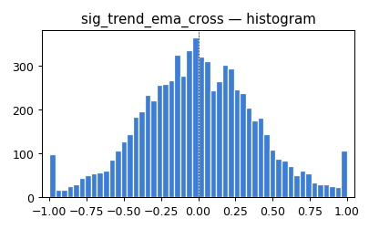 | 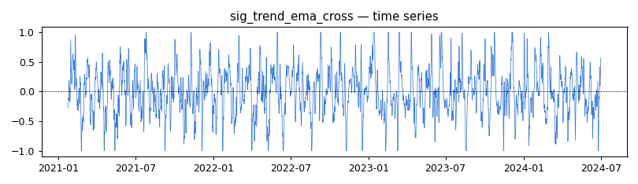 |
| `sig_trend_macd_hist` | trend | 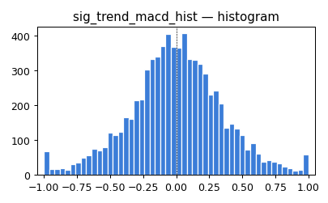 | 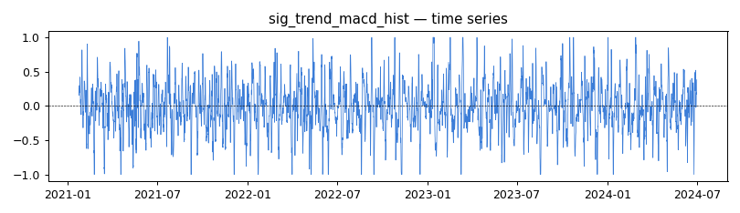 |
| `sig_trend_price_above_ma` | trend | 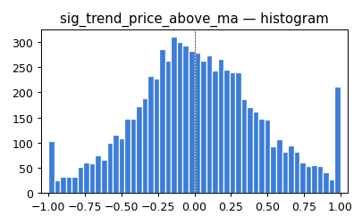 | 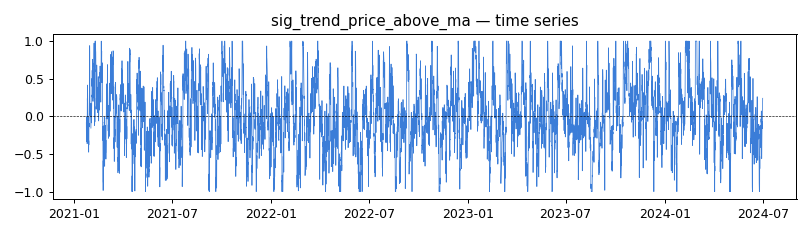 |
| `sig_trend_slope_21` | trend | 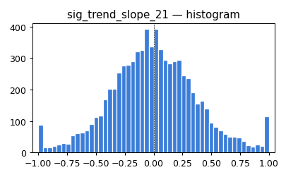 | 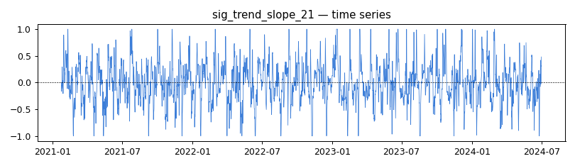 |
| `sig_mom_rsi_zone` | mom | 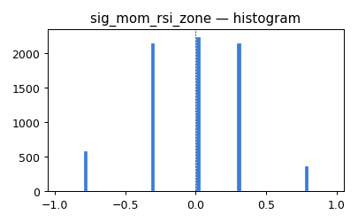 | 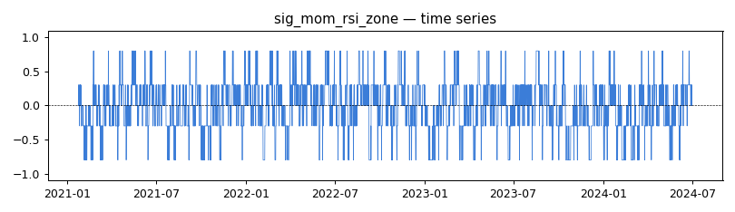 |
| `sig_mom_rsi_trend` | mom | 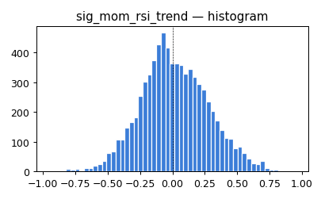 | 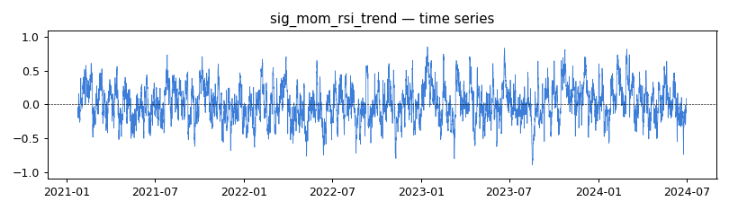 |
| `sig_mom_stoch_state` | mom | 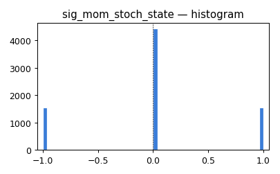 | 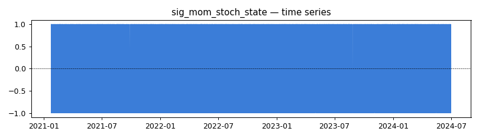 |
| `sig_mom_roc_zscore` | mom | 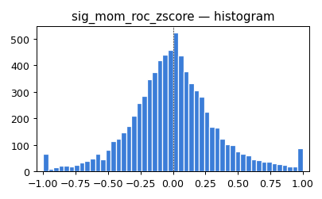 | 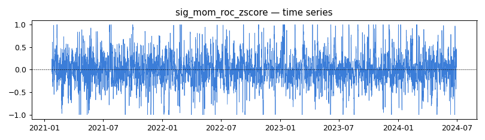 |
| `sig_vol_atr_pct` *(state, not direction)* | vol | 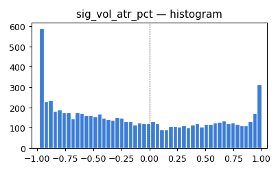 | 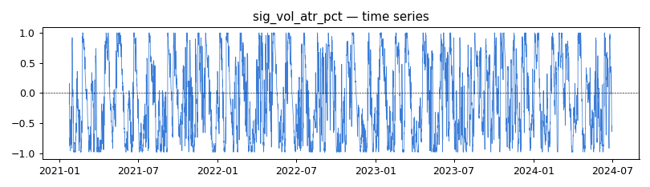 |
| `sig_vol_bb_width` *(state, not direction)* | vol | 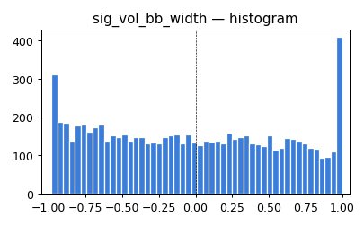 | 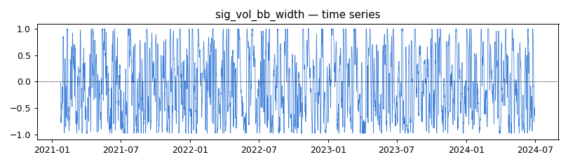 |
| `sig_vol_bb_position` *(state, not direction)* | vol | 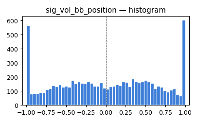 | 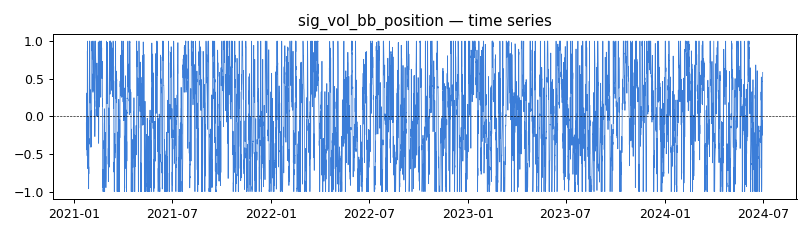 |
| `sig_volume_obv_slope` | volume | 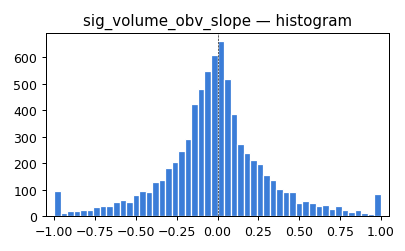 | 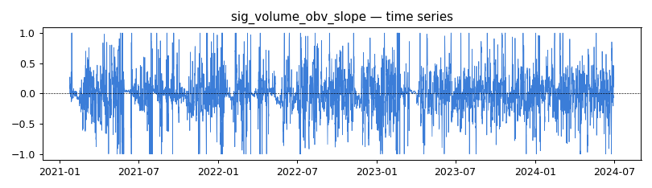 |
| `sig_volume_ratio` | volume | 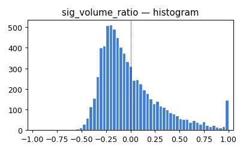 | 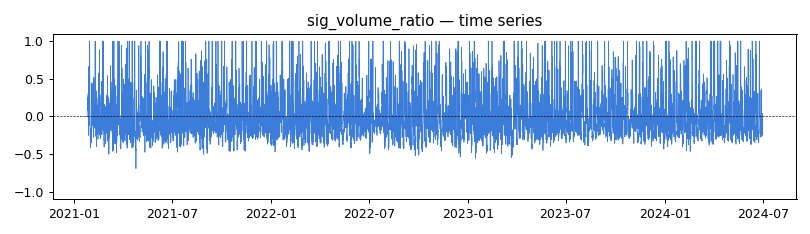 |
| `sig_regime_drawdown` | regime | 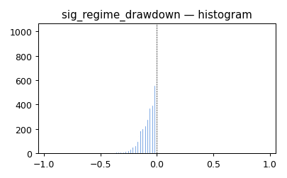 | 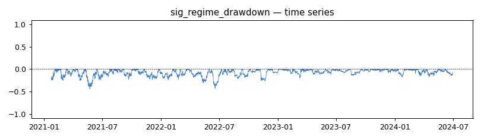 |
| `sig_regime_return_60` | regime | 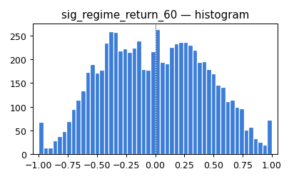 | 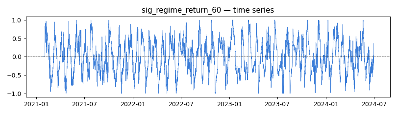 |

## 2. Pairwise Pearson correlation

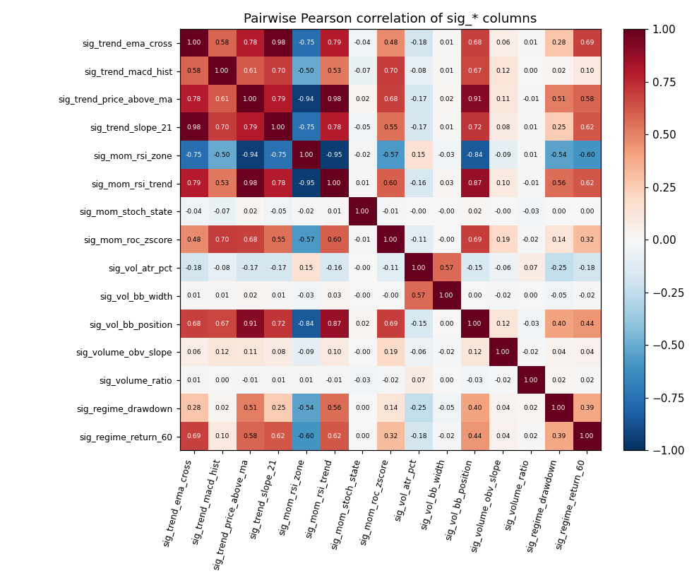

### Pairs with |ρ| > 0.95 — TC-A7 candidates for elimination

| Signal A | Signal B | Pearson |
|----------|----------|---------|
| `sig_trend_price_above_ma` | `sig_mom_rsi_trend` | +0.982 |
| `sig_trend_ema_cross` | `sig_trend_slope_21` | +0.978 |
| `sig_mom_rsi_zone` | `sig_mom_rsi_trend` | -0.952 |

## 3. Single-signal backtest (long-only, design §4.3)

Reference — Buy & Hold: Sharpe = **+0.292**, MaxDD = **-0.840**

| Signal | Group | Sharpe | Max Drawdown | Total Trades | Note |
|--------|-------|--------|--------------|--------------|------|
| `sig_trend_slope_21` | trend | +0.745 | -0.478 | 141 |  |
| `sig_mom_rsi_trend` | mom | +0.693 | -0.510 | 98 |  |
| `sig_trend_ema_cross` | trend | +0.682 | -0.544 | 117 |  |
| `sig_trend_price_above_ma` | trend | +0.528 | -0.640 | 230 |  |
| `sig_volume_ratio` | volume | +0.460 | -0.657 | 483 |  |
| `sig_regime_return_60` | regime | +0.391 | -0.684 | 100 |  |
| `sig_vol_bb_width` | vol | +0.360 | -0.696 | 292 | state signal — direction backtest not meaningful |
| `sig_vol_bb_position` | vol | +0.310 | -0.689 | 457 | state signal — direction backtest not meaningful |
| `sig_vol_atr_pct` | vol | +0.241 | -0.704 | 204 | state signal — direction backtest not meaningful |
| `sig_volume_obv_slope` | volume | +0.111 | -0.728 | 413 |  |
| `sig_mom_rsi_zone` | mom | +0.093 | -0.769 | 71 |  |
| `sig_mom_roc_zscore` | mom | +0.074 | -0.734 | 383 |  |
| `sig_regime_drawdown` | regime | +0.000 | +0.000 | 0 |  |
| `sig_trend_macd_hist` | trend | -0.167 | -0.753 | 225 |  |
| `sig_mom_stoch_state` | mom | -0.594 | -0.860 | 3103 | TC-A7: Sharpe < -0.2, elimination candidate |
