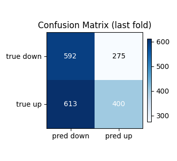
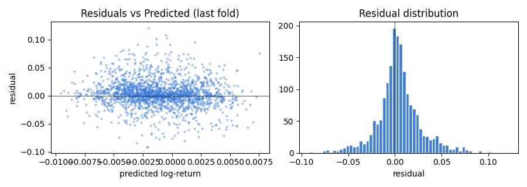
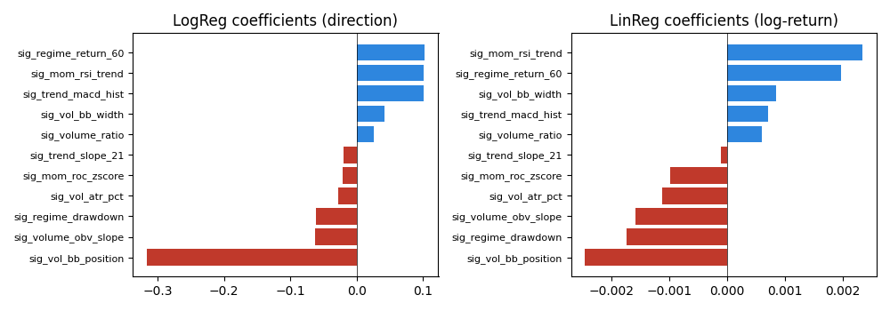

# Linear Baseline Report — TC-A6

- Generated: `2026-04-18T13:58:54`  
- Signals config: `config/signals_v1.yaml` (11 features)  
- Data cache: `data/cache/BTCUSDT_4h_2020-01-01_2024-07-01.parquet`  
- Target horizon: **k = 6 bars** (4h × 6 = 24h ahead)  
- CV: TimeSeriesSplit(3 folds, no shuffle)  
- Iron gate: AUC mean > **0.52** AND min > **0.5**  
- R² diagnostic: mean > **-0.1** (catastrophe check, not a positive-predictive gate)

## Verdict: ✅ PASS

| Metric | Rule | Min | Mean | Max | Pass |
|--------|------|-----|------|-----|------|
| ROC-AUC (LogReg, iron gate) | mean > 0.52 AND min > 0.5 | 0.5219 | 0.5424 | 0.5598 | ✅ |
| R² (LinReg, diagnostic) | mean > -0.1 | -0.0791 | -0.0644 | -0.0354 | ✅ |

## Per-fold metrics

| Fold | n_train | n_val | ROC-AUC | R² |
|------|---------|-------|---------|-----|
| 1 | 1,881 | 1,880 | 0.5219 | -0.0787 |
| 2 | 3,761 | 1,880 | 0.5598 | -0.0791 |
| 3 | 5,641 | 1,880 | 0.5454 | -0.0354 |

## Diagnostics (last fold)

## Feature weights (last fold)

Positive = bullish contribution; negative = bearish. Standardized features.

