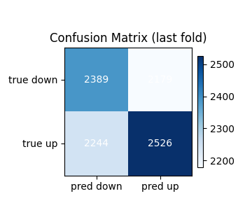
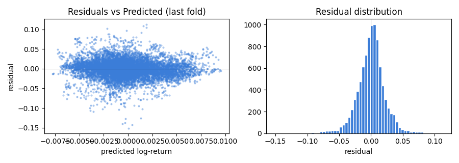
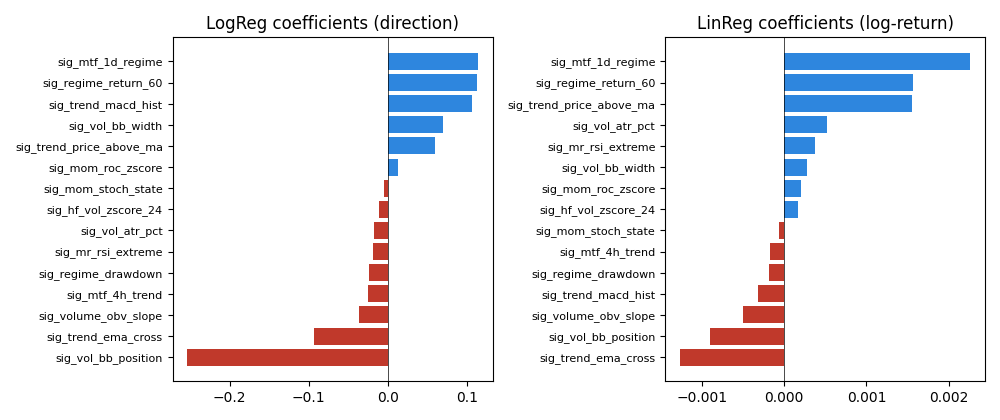

# Linear Baseline Report — TC-A6

- Generated: `2026-04-19T11:38:42`  
- Signals config: `config/signals_v1_1h.yaml` (15 features)  
- Data source: `config:stage2_1h_signal.yaml (tf=1h)`  
- Target horizon: **k = 24 bars**  
- CV: TimeSeriesSplit(3 folds, no shuffle)  
- Iron gate: AUC mean > **0.52** AND min > **0.5**  
- R² diagnostic: mean > **-0.1** (catastrophe check, not a positive-predictive gate)

## Verdict: ✅ PASS

| Metric | Rule | Min | Mean | Max | Pass |
|--------|------|-----|------|-----|------|
| ROC-AUC (LogReg, iron gate) | mean > 0.52 AND min > 0.5 | 0.5323 | 0.5360 | 0.5429 | ✅ |
| R² (LinReg, diagnostic) | mean > -0.1 | -0.0606 | -0.0170 | +0.0096 | ✅ |

## Per-fold metrics

| Fold | n_train | n_val | ROC-AUC | R² |
|------|---------|-------|---------|-----|
| 1 | 9,340 | 9,338 | 0.5323 | -0.0606 |
| 2 | 18,678 | 9,338 | 0.5429 | +0.0096 |
| 3 | 28,016 | 9,338 | 0.5328 | -0.0001 |

## Diagnostics (last fold)

## Feature weights (last fold)

Positive = bullish contribution; negative = bearish. Standardized features.

