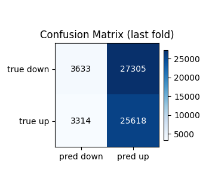
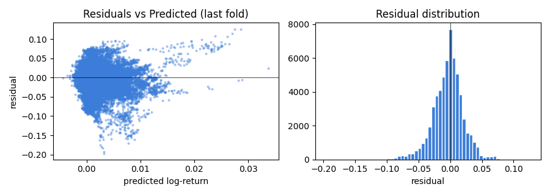
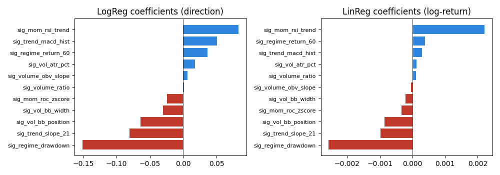

# Linear Baseline Report — TC-A6

- Generated: `2026-04-19T09:25:40`  
- Signals config: `config/signals_v1.yaml` (11 features)  
- Data source: `config:stage2_5min_signal.yaml (tf=5min)`  
- Target horizon: **k = 288 bars**  
- CV: TimeSeriesSplit(3 folds, no shuffle)  
- Iron gate: AUC mean > **0.52** AND min > **0.5**  
- R² diagnostic: mean > **-0.1** (catastrophe check, not a positive-predictive gate)

## Verdict: ❌ FAIL — Phase 2 frozen

| Metric | Rule | Min | Mean | Max | Pass |
|--------|------|-----|------|-----|------|
| ROC-AUC (LogReg, iron gate) | mean > 0.52 AND min > 0.5 | 0.4897 | 0.5147 | 0.5416 | ❌ |
| R² (LinReg, diagnostic) | mean > -0.1 | -0.0271 | -0.0045 | +0.0080 | ✅ |

## Per-fold metrics

| Fold | n_train | n_val | ROC-AUC | R² |
|------|---------|-------|---------|-----|
| 1 | 59,873 | 59,870 | 0.5416 | +0.0080 |
| 2 | 119,743 | 59,870 | 0.5128 | +0.0058 |
| 3 | 179,613 | 59,870 | 0.4897 | -0.0271 |

## Diagnostics (last fold)

## Feature weights (last fold)

Positive = bullish contribution; negative = bearish. Standardized features.

## Next steps (iron-gate failure)

- Return to §4 signal design — not a hyperparameter issue.
- Check whether any sig_* is degenerate post-warmup (flat, near-zero std).
- Consider adding non-linear transformations that linear models miss (interaction terms, regime-conditioned features).
- Do NOT proceed to Phase 2 PPO training until this gate passes.
